# 🔁Sorting

Sorting is a C++ project that empirically verifies the upper bound
of various sorting algorithms, as well as gather performance data
on algorithms in the same Big-O class.

## Installation 

This project can be run in the commandline via g++, or by compiling in CLion using the CMakeLists.txt file with your chosen compiler. Below I will show you how to install g++.

First, check if g++ is installed.
```text
$ g++ --version
```
If it is not installed, install it.
```text
$ sudo apt-get install g++
```

## Usage
First, navigate to the project directory.
```text
$ cd FullFilePathHere
```
Next, compile all the relevant files using g++
```text
$ g++ src/main.cpp 
```
Run the program, this program takes __ command line arguments

```text
data/size100/100-60ascending_noDup.txt data/size100/100-random_20Dup.txt data/size100/100-random_40Dup.txt data/size1000/1000-60ascending_noDup.txt data/size1000/1000-random_20Dup.txt data/size1000/1000-random_40Dup.txt data/size10000/10000-60ascending_noDup.txt data/size10000/10000-random_20Dup.txt data/size10000/10000-random_40Dup.txt data/size50000/50000-60ascending_noDup.txt data/size50000/50000-random_20Dup.txt data/size50000/50000-random_40Dup.txt data/size100000/100000-60ascending_noDup.txt data/size100000/100000-random_20Dup.txt data/size100000/100000-random_40Dup.txt data/size500000/500000-60ascending_noDup.txt data/size500000/500000-random_20Dup.txt data/size500000/500000-random_40Dup.txt data/size1mil/60ascending_noDup.txt data/size1mil/ascending_noDup.txt data/size1mil/random_20Dup.txt data/size1mil/random_40Dup.txt data/size1mil/random_noDup.txt
```

## Dataset Generation
In order to test the efficiencies of each of the sorting algorithms, different datasets have been generated.
The datasets have been split into two categories, integer based and string based,
with 6 datasets each:
- a randomized dataset with 0% duplicates
- dataset with 0% duplicates in ascending order
- dataset with 0% duplicates with 60% already in sorted ascending
    - This was generated by placing the ascending elements in the first 60% of the list,
followed by the randomized elements
    - This will likely be changed in order to have a more even distribution
- randomized dataset with 20% duplicates
- randomized dataset with 40% duplicates

Each of these datasets were generated using a python script, src/main.py, which is included
in the repository, and are formatted as followed:
```
<number of elements>
<element 1>
<element 2>
...
```
In order to ease the generation of random sequences, the files containing the datasets
will be the same for both categories. The only difference being the way these elements will be stored, 
with either ints or string data types.

All datasets can be found in the data folder.

## Algorithm Analysis
In this section we will be discussing the different observations reached when testing
these algorithms with the various datasets. We will also include observations regarding 
the performance of these algorithms as the datasets grew in size and how it compares with 
published upper limits.

### Insertion Sort
Insertion sort works similarly to how you would sort playing cards in your hand: by iterating
through the list and picking the smallest item and placing it next in line. This algorithm is known
for being very efficient on smaller lists, but very quickly gets worse for larger lists.

Here are the graphs showing the algorithm's performance with the various integer and string datasets:

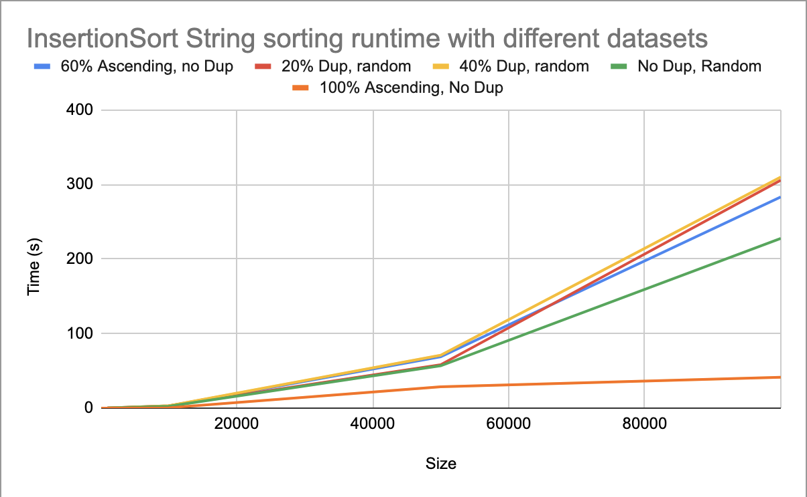
As shown in the graph, the insertion algorithm follows a nice O(n^2) line for its worse case
runs. As expected, the dataset with the fastest run was the one with all ascending elements, followed by 
the partially ascending and random with no duplicates. However, when it came to the datasets with duplicates, 
the efficiency of the algorithm reduced greatly. This could be due in part to the fact that the duplicate values
were usually smaller values, resulting in iterating through the entire dataset to retrieve and place them. The 
set that is 60% sorted shows a heightened efficiency in comparison to the duplicate sets. This is because insertion
sort works best with partially sorted and smaller sets, as they require less comparisons overall. However, when
it came to comparing strings, the randomized and partially sorted sets tended to rise in time.


### Quick Sort
The quicksort algorithm functions by recursively splitting the list along a randomly chosen pivot value, in which
the left half is less than the pivot and the right half is greater. Although the upper bound is the same as 
Insertion sort, the and average case is reduced from O(n^2) to O(n ln n).

Here are the graphs showing the algorithm's performance with the various integer and string datasets:
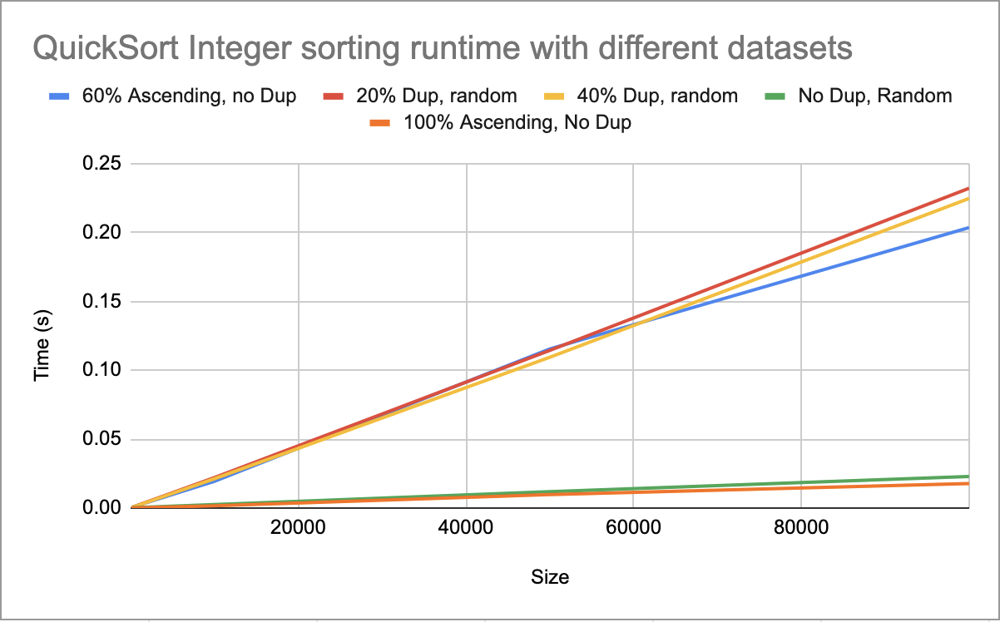
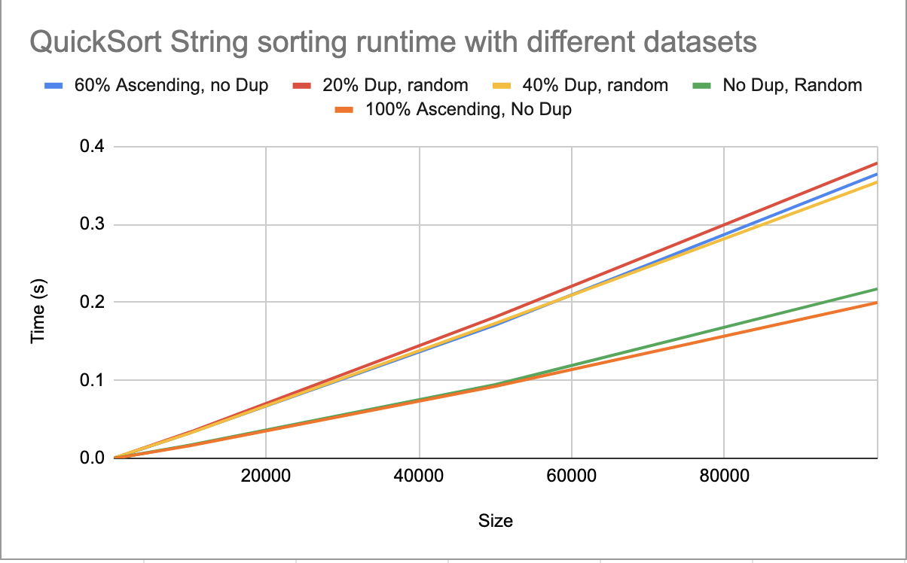

These graphs seem to resemble the insertion sort graphs, in that it the upper bound loosely follows 
a O(n^2) curve. However, in this case, the fully randomized set with no duplicates, more consistently 
follows the fully ascending set. This matches the published values for the lower bound and average, as 
both are O(n ln n). With the sets containing duplicates, as with insertion, the efficiency lowers due to 
the need to have more comparisons. The performance also decreases greatly when comparing strings instead of 
integers, mainly do to the need to have more comparisons per element. Nevertheless, both the integer and string
graphs follow similar trends.

### Merge Sort
With merge sort, we begin to observe algorithms that sacrifice ease of implementation for efficiency. This algorithm
follows a divide and conquer, by recursively splitting the set in half and merging the subsets in order. In this 
algorithm, the lower and upper bounds are closer with both laying at (n ln n), allowing for
a more stable sort.

Here are the graphs showing the algorithm's performance with the various integer and string datasets:
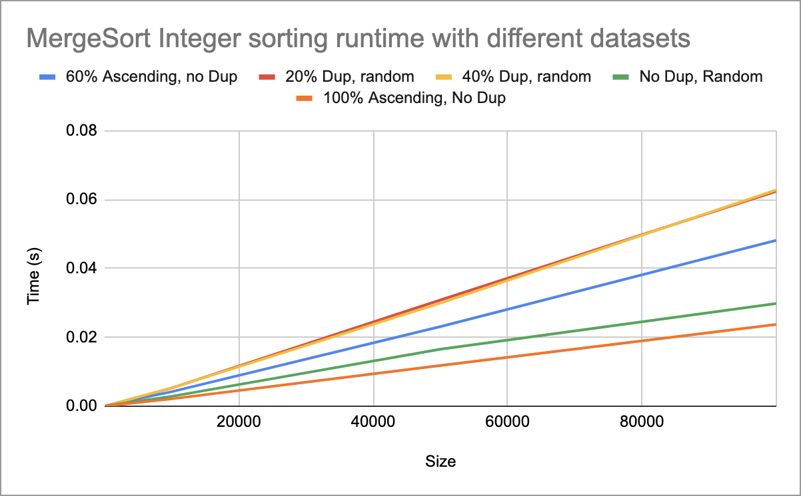 
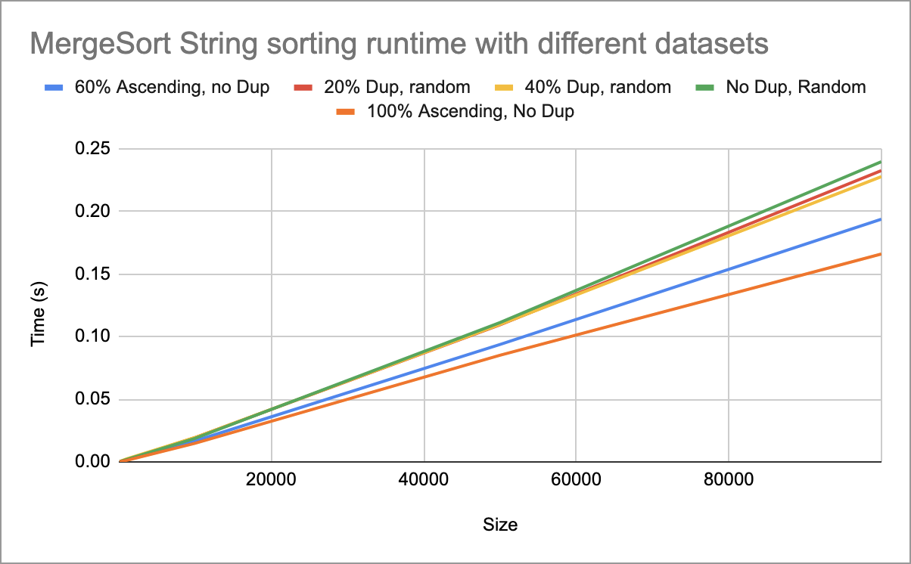

These graphs differ greatly from the those of the two sorts seen previously as the different datasets 
seem to be more scattered in their performances. However, with a closer look we do see some similarities:
that being the fully ascending and partially ascending tend have a faster performance than the duplicate sets,
as well as the string datasets all being less efficient than the integer sets. 

One notable difference we do see is the drastic difference in the disparity between the best and worst performances
of the algorithm. All the sets are more clumped together, showing a smaller difference between the worst performances
and the best.

### Shell Sort
Shell sort is a variation on insertion sort that attempts to fix its worst case scenario, that being moving data
across large gaps. This is a case seen previously with the poor performance of the duplicate sets, as the duplicate
values had to be moved through the length of the list.

Here are the graphs showing the algorithm's performance with the various integer and string datasets:
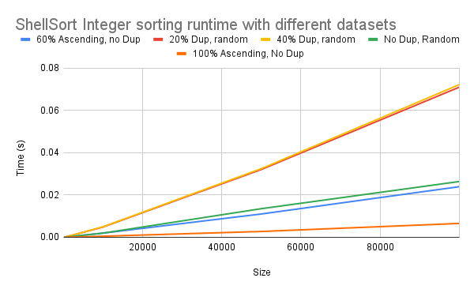
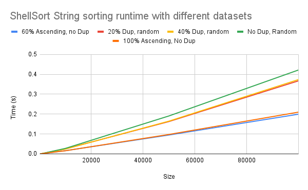

Although the graphs seem to show that the worse case remains as significantly inefficient, a closer look 
at the step size of the x-axis shows a significant improvement in performance. This closely resembles the 
published bounds of this algorithm, as the upper bound still remains at O(n^2) with the two duplicate sets. The lower
bound, in this case O(n ln n), still remains to be with fully sorted and partially sorted lists.

Unlike Insertion sort, this data set seems to handle the growing sizes of the datasets significantly better, showing
a shallower curve. Additionally, the performance of the string sets is generally lower than that of the integer sets.

### Intro Sort
The sort used by the Standard Template Library, this sort is highly complex and serves to take the advantages,
of insertion, quicksort, and heap sort in order to create a stable and dependable sorting algorithm. However, this does
lead to a highly advanced and difficult implementation.

Here are the graphs showing the algorithm's performance with the various integer and string datasets:
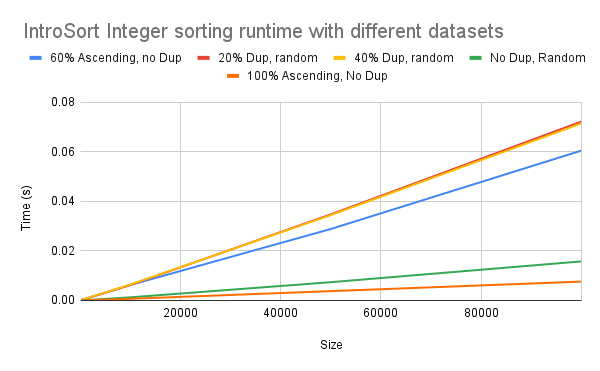
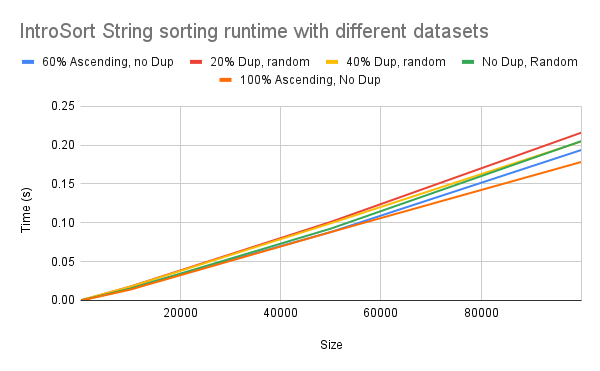


### Tim Sort
Also a hybrid sort, this sort was created to be optimized for real world data for use in python. This sort
includes implementation of merge and insertion sort.

Here are the graphs showing the algorithm's performance with the various integer and string datasets:
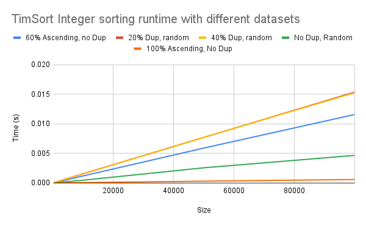
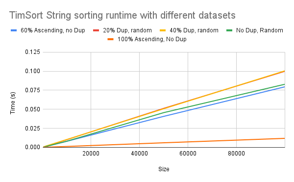

## Credits

This project was completed entirely by Zachary Suzuki and 
Daniel Ryan for CS3353, Fundamentals of Algorithms taught by Dr. Fontenot.

